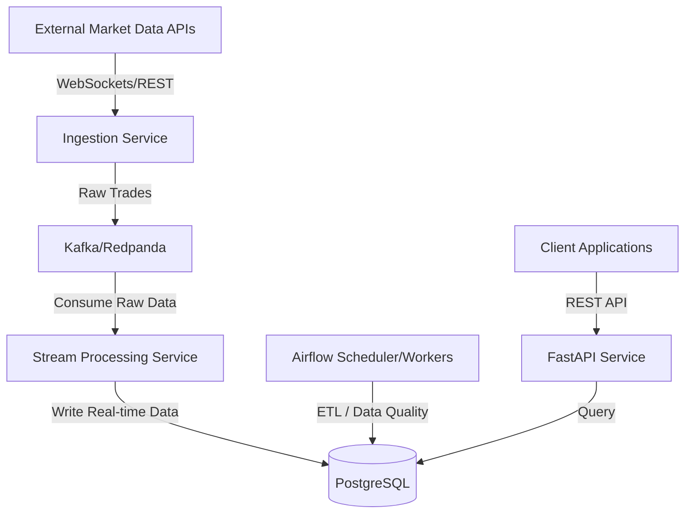
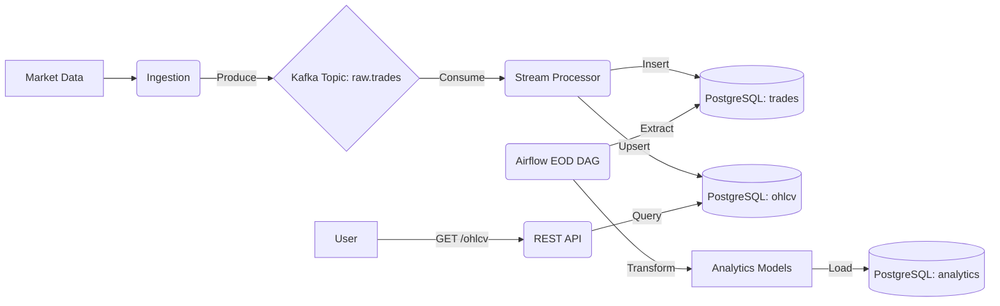

# Financial Data Engineering Platform: Architecture Document

## 1. Architecture Overview
The system is a distributed financial data engineering platform designed to ingest, process, store, and serve real-time and batch market data. It separates concerns between real-time event streaming (low latency) and batch processing (high throughput, complex transformations). The architecture utilizes Python 3.11, Kafka for event streaming, PostgreSQL for relational storage, Airflow for batch orchestration, and FastAPI for data serving.

## 2. Scope and Phasing
To maintain an achievable scope for a single developer while demonstrating portfolio-grade capabilities, the architecture is divided into three phases:

### Phase 1: MVP & Local Development
- Core Python microservices (Ingestion, Stream Processing, API).
- Local infrastructure orchestrated via Docker Compose.
- **Redpanda** acting as a lightweight, Kafka-compatible local broker.
- PostgreSQL for local database storage.
- Extensive TDD loop with pytest.

### Phase 2: Production Baseline
- Containerized deployment to Google Kubernetes Engine (GKE).
- Cloud SQL for managed PostgreSQL.
- Google Cloud Storage (GCS) and Artifact Registry.
- Terraform for foundational infrastructure provisioning.
- Basic IAM and Secret Manager integration.
- CI/CD via GitHub Actions.

### Phase 3: Optional Advanced Production Features
- Private networking (VPC peering, private GKE clusters).
- Advanced IAM (Workload Identity, strict least-privilege policies).
- Autoscaling via KEDA (Kafka-lag-based scaling for stream processors).
- Database read replicas to isolate API reads from processing writes.
- Advanced security controls (WAF, strict K8s network policies).

## 3. Component Responsibilities
- **Ingestion Service (FastAPI / WebSockets)**: Connects to external market data providers, normalizes incoming ticks/trades, and publishes them to Kafka.
- **Message Broker (Kafka / Redpanda)**: Acts as the central nervous system, decoupling data producers from consumers and buffering high-velocity streams.
- **Stream Processing Service (Python)**: Consumes raw market events, performs real-time aggregations (e.g., OHLCV candles), and writes results to PostgreSQL.
- **Database (PostgreSQL)**: The core system of record. Stores normalized relational data, raw trade histories, and aggregated time-series data.
- **Batch Orchestrator (Apache Airflow)**: Schedules and monitors batch ETL workflows, data-quality checks, and end-of-day analytics.
- **API Service (FastAPI)**: Serves historical data, aggregated analytics, and instrument metadata to end-users via REST endpoints.
- **Infrastructure Orchestration**: Terraform provisions cloud resources; Kubernetes manages application containers.

## 4. System Architecture Diagram

## 5. Data-Flow Diagram

## 6. Kafka Architecture & Event Streaming
- **Kafka Topics**: 
  - `market.trades.raw` (Raw trade events)
  - `dlq.market.trades` (Dead-letter queue for unprocessable messages)
- **Producer Architecture**: The Ingestion Service uses async producers with `acks=all` for durability and `enable.idempotence=true` to prevent duplicates on transient network retries.
- **Partitioning Strategy**: Data is partitioned by `instrument_id`. Partition count will be determined empirically through load testing based on target throughput, consumer processing capacity, and expected instrument cardinality.
- **Event Ordering & Late-Arriving Data**: Kafka guarantees ordering of messages *within a partition*. However, real-world financial events can arrive out of order due to network jitter or source delays. The stream processor handles this by leveraging *event-time* (the timestamp from the exchange) rather than processing-time, maintaining a watermarking strategy or an in-memory buffer to correctly aggregate late-arriving events into historical OHLCV windows.
- **Delivery Semantics & Idempotency**: Kafka provides *at-least-once delivery*. PostgreSQL idempotency keys and conflict-safe writes (`ON CONFLICT DO NOTHING` or `DO UPDATE`) prevent duplicate business effects during message redelivery.
- **Database/Offset Transaction Boundary**: PostgreSQL and Kafka are entirely separate systems and do not share an atomic transaction. The intended processing sequence is:
  1. `BEGIN DB TRANSACTION`
  2. Write/upsert records to PostgreSQL
  3. `COMMIT DB TRANSACTION`
  4. `COMMIT KAFKA OFFSET`
  
  *Crash Window*: A critical crash window exists between step 3 (DB commit) and step 4 (Kafka offset commit). If a consumer crashes in this window, Kafka will redeliver the message upon restart. Database idempotency is absolutely required to safely ignore or safely re-apply these redelivered records without corrupting the financial data.
- **Dead-letter handling**: Non-transient errors (e.g., schema validation failures) result in the payload being published to a `dlq.*` topic, followed by an offset commit to unblock the partition.

## 7. PostgreSQL Data Model
- **Schema Overview**:
  - `instruments`: `id` (UUID, PK), `symbol`, `asset_class`, `is_active`.
  - `market_trades`: `id` (UUID, PK), `instrument_id` (FK), `price`, `volume`, `event_time`.
  - `market_ohlcv`: `instrument_id` (FK), `timeframe`, `window_start`, `open`, `high`, `low`, `close`, `volume`.
- **Database Indexes**: 
  - B-Tree index on `(instrument_id, event_time DESC)` for fast time-series queries.
  - Unique composite index on `(instrument_id, timeframe, window_start)` to enforce idempotency via `ON CONFLICT` during UPSERTs.

## 8. Airflow Workflow Architecture
- **Airflow DAGs**: Orchestrates batch workloads completely isolated from real-time streaming.
  - `eod_market_data_sync`: Runs at market close.
  - `data_quality_checks`: Asserts data completeness and accuracy (e.g., anomaly detection).
- **Task Dependencies**: `wait_for_market_close` (Sensor) -> `extract_daily_trades` -> `calculate_daily_metrics` -> `load_metrics_to_db`.

## 9. API Architecture
- **REST API (FastAPI)**:
  - `GET /api/v1/instruments/{symbol}/trades`: Fetch historical trades.
  - `GET /api/v1/instruments/{symbol}/ohlcv`: Fetch candlestick data.
- **Stateless & Async**: Built with FastAPI for high async performance and strict OpenAPI documentation.

## 10. Testing Strategy (TDD)
- **Test-Driven Development (TDD) Workflow**: The project adheres strictly to the **Red → Green → Refactor** loop.
  - *Example (OHLCV Aggregation)*: 
    1. **Red**: Write a test providing an unordered list of raw trades (including late-arriving events) to the aggregator. Assert the correct calculation of Open, High, Low, Close, and Volume. The test fails because the logic isn't written.
    2. **Green**: Write the most basic business logic to group by timeframe, find min/max prices, and pass the test.
    3. **Refactor**: Optimize the aggregation logic for memory efficiency and readability while ensuring the tests remain green.
- **Unit Testing**: Tests pure business logic in complete isolation. Mocks external boundaries (Kafka, DB). Extremely fast and deterministic.
- **Integration Testing**: Tests the intersection of components. Uses `testcontainers-python` to spin up ephemeral PostgreSQL and Redpanda containers. Validates SQL queries, idempotency constraints, and Kafka publish/consume mechanics.
- **End-to-End (E2E) Testing**: Tests the full lifecycle by deploying to a local `kind` (Kubernetes in Docker) cluster, injecting synthetic data, and validating API responses.

## 11. Infrastructure & GCP Architecture
- **GKE (Google Kubernetes Engine)**: Hosts containerized microservices and Airflow.
- **Cloud SQL for PostgreSQL**: Managed database ensuring automated backups and high availability.
- **Google Cloud Storage (GCS) & Artifact Registry**: For Airflow logs/DAGs and Docker images.
- **Secret Manager**: Secure storage of API keys and DB credentials.
- **Terraform**: Infrastructure-as-code for provisioning GCP resources.

## 12. Kafka Deployment Strategy
- **Local Development**: **Redpanda** is used in Docker Compose. It provides a Kafka-compatible API without the JVM/Zookeeper overhead, making local environments fast and lightweight.
- **Production**: A **Managed Kafka** service (e.g., Confluent Cloud, MSK, or a GCP-native equivalent) is strongly preferred over self-hosting Kafka on Kubernetes.
  - *Tradeoff*: Self-hosting Kafka on GKE provides maximum control and avoids vendor lock-in, but requires immense operational overhead (managing StatefulSets, KRaft/Zookeeper, volume claims, and broker rebalancing). Managed Kafka shifts this operational burden to the provider, allowing a single developer to focus strictly on business logic, at the cost of higher cloud spend.

## 13. Interview Defensibility: Architectural Decisions & Tradeoffs

**1. Kafka for Message Broker**
- **Problem solved**: Decouples high-velocity ingestion from complex stream processing, buffering data during downstream slowdowns.
- **Why selected**: Industry standard for event streaming; provides robust partition-based ordering and consumer groups.
- **Tradeoff**: Introduces more operational and cognitive complexity compared to simpler queues (like RabbitMQ or Redis).
- **Failure mode addressed**: Prevents catastrophic data loss if the database or stream processor goes down; Kafka simply buffers the events until services recover.

**2. PostgreSQL over Specialized Time-Series DB (e.g., TimescaleDB)**
- **Problem solved**: Provides reliable ACID transactions and relational integrity for financial instruments and trades.
- **Why selected**: Universally understood; demonstrates core SQL competency which is critical for general software engineering interviews.
- **Tradeoff**: Standard Postgres is less efficient at pure time-series aggregation at massive scale compared to purpose-built databases.
- **Failure mode addressed**: Idempotent upserts (`ON CONFLICT`) easily and reliably address Kafka's at-least-once redelivery semantics.

**3. Separate Database/Offset Transaction Boundaries**
- **Problem solved**: Integrates two disparate distributed systems (Kafka and Postgres) without requiring expensive and fragile distributed transactions (Two-Phase Commit).
- **Why selected**: Explicit manual offset commits after DB commits represent the pragmatic industry standard for microservices.
- **Tradeoff**: Forces the application layer to handle redelivery and enforce idempotency.
- **Failure mode addressed**: A consumer crash immediately after writing to the database but before committing the offset will result in a redelivery, which is safely neutralized by the database's unique constraints.

**4. Phased Architecture (MVP vs. Advanced)**
- **Problem solved**: Prevents "analysis paralysis" and scope creep.
- **Why selected**: Proves engineering ability rapidly (MVP) while showing awareness of enterprise requirements (Advanced).
- **Tradeoff**: Some production-hardening (like private VPC peering or read replicas) is deferred, accepting technical debt for speed.
- **Failure mode addressed**: Reduces the risk of failing to deliver a working end-to-end system by prioritizing the core ingestion/processing loop.
